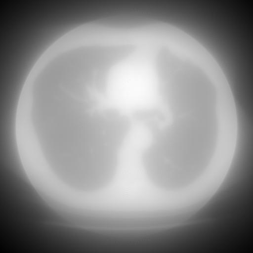
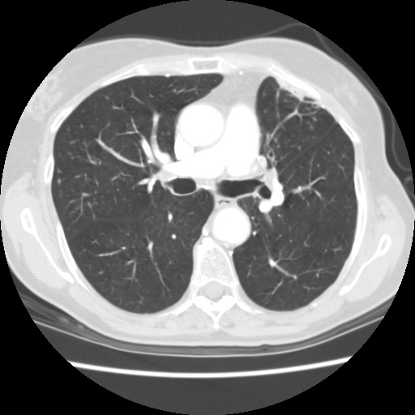

# **Image Denoising using GAN**

### **Used libraries with their versions:**
* Tensorflow: 2.6.0
* Keras: 2.6.0
* Matplotlib: 3.4.3
* Numpy: 1.19.5
* Pillow: 8.2.0
* tqdm: 4.62.3

# Input image with noise

# Generated image by the model

# Original image

