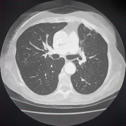

# **Image Denoising using GAN**
This project implements the denoising task on a blurry image. A blurry image is converted into a noise free image using a Generated Adverasarial Network(GAN).

## **Instructions to use the project:**
> **Preparing the dataset:**
* The dataset consists of pairs of noisy and ground truth images
* Have to keep the noisy images in a folder and ground truth in another
* Have to keep train and test datasets in seperate folder

> **Training:**
* The train.ipynb trains the model with the dataset

> **Testing:**
* The test.ipynb generates the images and tests the result on test dataset

## **Input, Output and Generated Images:**
> **Input image with noise**

> **Ground Truth image:**

> **Generated image by the model**

## **Used libraries with their versions:**
* Tensorflow: 2.6.0
* Keras: 2.6.0
* Matplotlib: 3.4.3
* Numpy: 1.19.5
* Pillow: 8.2.0
* tqdm: 4.62.3
